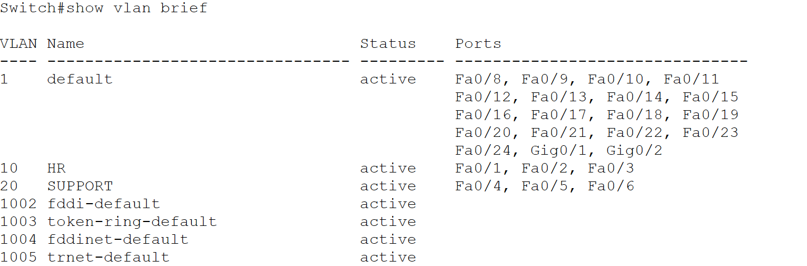
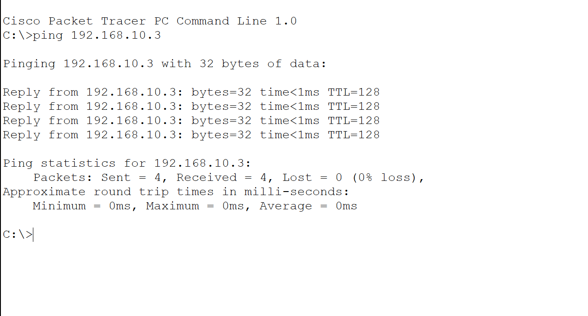

# vlan-network-segmentation
Implemented VLAN segmentation and Inter-VLAN routing using Cisco Packet Tracer to improve network organization and communication between departments.
# VLAN Network Segmentation

## Overview

Designed and implemented VLAN segmentation using Cisco Packet Tracer to separate network departments and improve network organization.

## Technologies Used

- VLAN
- Cisco Switches
- Network Segmentation
- Inter-VLAN Routing (Optional)

## Features

- Created multiple VLANs
- Assigned switch ports to VLANs
- Verified VLAN communication
- Tested network connectivity

## Tools

- Cisco Packet Tracer

## Outcome

Successfully implemented VLAN segmentation and verified communication between devices.

## Screenshots

### Topology

### VLAN Configuration

### Port Assignment

### Connectivity Test

